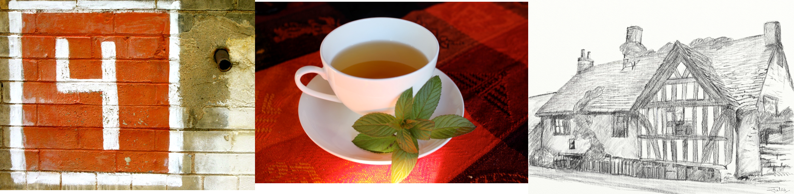

Knowing what's next is a great and powerful skill. Can you spot the next in the sequence?

1. Enid Blyton gave us the secret _ _ _ _ _ _ _ ?
2. Say what you see: 
<!-- 1 + 2 + 3 + 4 + 5 + 6 = 21 -->
3. Today you are 6. Add up all the ages you have ever been?

You'll notice that this page is called `numberland/2` (take a look at the URL).
To continue change this to `numberland/x` where x is the next number in the sequence?

For example, if you thought the next in the sequence was 73 change it to [`numberland/73`](73).